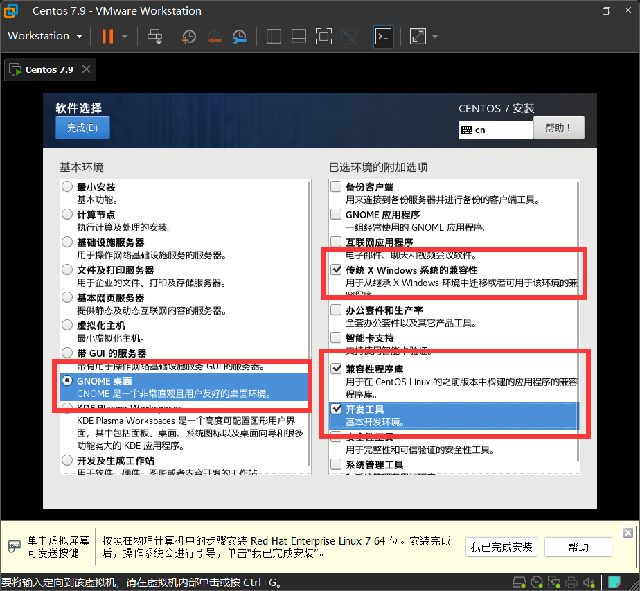

## Linux简介

#### 1.Linux主要发行版本

Ubuntu【乌班图】、RedHat【红帽】、CentOS、Debain【蝶变】、Fedora、SuSE、OpenSUSE

#### 2.linux下载地址

http://isoredirect.centos.org/centos/7/isos/x86_64/

#### 3. 安装注意事项

在软件源中进行设置，修改最小安装，改为带桌面的

#### 4.分区

通常来说分为3个分区

* boot分区/boot 【1G】标准分区ext4
* 交换分区/swap【内存多少就多少】标准分区swap
* 根分区/【剩下的空间】标准分区ext4

#### 5.网络

可以修改主机名，这次我们叫作Centos

#### 6.密码

root账户 密码123456

Cloud账户 密码123456