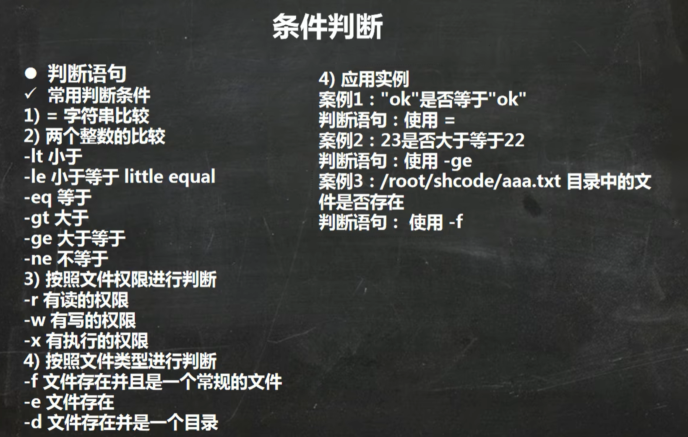

### 入门
2. 1. 脚本要以#!/bin/bash开头
2. 脚本需要有课执行权限

这里我就先在/home/shcode中编写

```
#!/bin/bash
echo "hello world"
```

```
如果需要执行脚本，那么就需要给文件赋予权限
chmod u+x hello.sh

如果不想赋予权限，也可以
sh hello.sh
```


### 变量

shell分为系统变量和自定义变量

变量名一般都是大写字母，变量名可以由字母，数字，下划线组成，不能以数字开头

```
系统变量 $HOME  $PWD  $SHELL 等等
显示当前shell中所有变量 set
```

```
自定义变量

定义变量 变量名=值
销毁变量 unset 变量名
静态变量 readonly 变量
```

```
定义变量A，并输出
A=100
echo A=$A
```

```
删除变量A，尝试输出
unset A
echo A=$A   A=
```

```静态变量
静态变量
readonly B
B=100      会失败
```

```
把date返回的结果赋给A
A=`date`
A=$(date)
```


### 设置环境变量

```
将shell变量输出为环境变量/全局变量
export 变量名=变量值

让修改后的配置信息立即生效
source 配置文件

查询环境变量的值
echo $变量名
```


```
在/etc/profile文件中定义TOMCAT_HOME环境变量
export TOMCAT_HOME=/opt/tomcat

让环境变量生效
source /etc/profile

查看环境变量TOMCAT_HOME的值
echo $TOMCAT_HOME
```

```sh
# 当然，在sh文件中也是读取到的
echo "tomcat_home=$TOMCAT_HOME"
```


### sh多行注释

```
:<<!
这里写注释
!
```


### 位置参数

```
我们在执行sh脚本的时候，可以这么写
./myshell.sh 100,200,300
这个就是动态输入，相当于把shell当成一个方法来看，那么shell里怎么获取到这几个数字呢？
```

| 符号 |                             说明                             |
| :--: | :----------------------------------------------------------: |
|  $n  | `$0`代表命令本身 `$1-9`代表第1到9的参数，10以上要大括号`${10}` |
|  $*  |           代表所有参数，把所有的参数看看做一个整体           |
|  $@  |       把所有参数看成一个整体，但是$@吧每个参数区分对待       |
|  $#  |                        就是参数的个数                        |


### 预定义变量

| 符号 |                      说明                       |
| :--: | :---------------------------------------------: |
|  $$  |                   当前进程号                    |
|  $!  |         后台运行的最后一个进程的进程号          |
|  $?  | 最后一次执行命令的返回状态，0成功，其他则为异常 |


### 运算符

```
expr 运算符
# 或者
$((运算式))
# 或者
$[运算式]
```

| 运算符 |      说明      |
| :----: | :------------: |
|   +    |       加       |
|   -    |       减       |
|   *    |       乘       |
|  \\*   | 【expr限定】乘 |
|   /    |       除       |
|   %    |      取余      |

```
计算(2+3)*4

$[(2+3)*4]
或者
$(((2+3)*4))
或者
a=`expr 2 + 3`
b=`expr $a \* 4`
```

```
算出命令行输入的2个参数之和[20, 50]
echo $[$1 + $2]
```


### 条件判断



```
[ 判断条件非空返回true ] && echo "true执行" || echo "false执行"
```

```
判断ok是否等于ok
if [ "ok" = "ok" ]
then
	echo "equal"
fi
```

```
23是否大于22？
if [23 -ge 22 ]
then
	echo "大于"
fi
```

```
判断文件是否存在
if [ -f /home/hello.sh ]
then
	echo "存在"
fi
```

```
如果要[]中间为空，就需要打个空格，语法要求
if [ ]
then
	echo "不输出"
fi
```


#### 多分支

```
if [ ]
then
	echo "分支1"
elif [ ]
then
	echo "分支2"
fi
```

```
判断输入的参数是否大于60
if [ $1 -ge 60 ]
then
	echo "及格"
elif [ $1 -lt 60 ]
then
	echo "不及格"
fi
```


#### case

```
输入1输出周一，输入2输出周二，其他输出other
case $1 in
"1")
echo "周一"
;;
"2")
echo "周二"
;;
echo "other"
;;
esac
```


### for

```
for i in "$*"
do
	echo "num is $i"
done
-----------------------------
如果下面我执行 sh for.sh 10 20 30
那么会输出的结果是 【num is 10 20 30】
```

```
for i in "$@"
do
	echo "num is $i"
done
-----------------------------
如果下面我执行 sh for.sh 10 20 30
那么会输出的结果是:
num is 10
num is 20
num is 30
```

```
输出1加到100的值
SUM=0
for(( i=1; i<=100 i++ ))
do
	SUM=$[$SUM+$i]
done
echo "SUM=$SUM"

------------------------------------
动态输入
SUM=0
for(( i=1; i<=$1 i++ ))
do
	SUM=$[$SUM+$i]
done
echo "SUM=$SUM"
```


### while

```
从命令行输入n，从1到n叠加
SUM=0
i=0
while [ $i -le $1 ]
do
	SUM=$[$SUM+$i]
	i=$[$i+1]
done
echo "执行结果=$SUM"

```


### read读取控制台输入

```
read 选项 参数
```

| 选项 |                 说明                 |
| :--: | :----------------------------------: |
|  -p  |         指定读取值时的提示符         |
|  -t  | 指定读取时的等待时间【秒】超过不等了 |

```
读取控制台输入的num1值

read -p "请输入一个数" NUM1
echo "你输入的数是$NUM1"
---------------------------
sh read.sh 然后程序会等待，你在控制台输入了数字80才会继续执行
你输入的数是80
```

```
读取控制台输入的num2值，要求10秒内输入
read -t 10 -p "请输入一个数" NUM2 
---------------------------------
同上，就是只会等待10秒
```


### 函数

```
返回/home/aaa/test.txt 的 test.txt部分
basename /home/aaa.txt
---------------------------------------------
如果只要test
basename /home/aaa.txt .txt
```

```
返回/home/aaa/test.txt 的 /home/aaa
dirname /home/aaa/test.txt
```


### 自定义函数

```sh
计算2个参数之和
# 自定义函数
function getSum() {
	SUM=$[$n1+$n2]
	echo "和是=$SUM"
}
# 控制台输入
read -p "请输入n1=" n1
read -p "请输入n2=" n2
# 调用
getSum $n1 $n2
```

